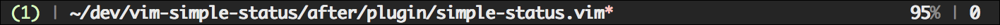

# Simple-status
A simple status line for terminal vim.

Based on NeatStatus by Luke Maciak, which can be found
[here](https://github.com/maciakl/vim-neatstatus).

## Features
Simple-status aims to only show useful information, in a compact way.
Simple-status displays the following:
* Buffer number - this changes color based on mode.
* File path - this is followed by a red asterisk if the buffer is unsaved.
* Read-only flag, if the file is read-only.
* Percent progress through file
* Column number

## Screenshot


## Installation
The recommended way to install this plugin is with
[pathogen](https://github.com/tpope/vim-pathogen):
```bash
git clone git@github.com:adamheins/vim-simple-status ~/.vim/bundle
```
